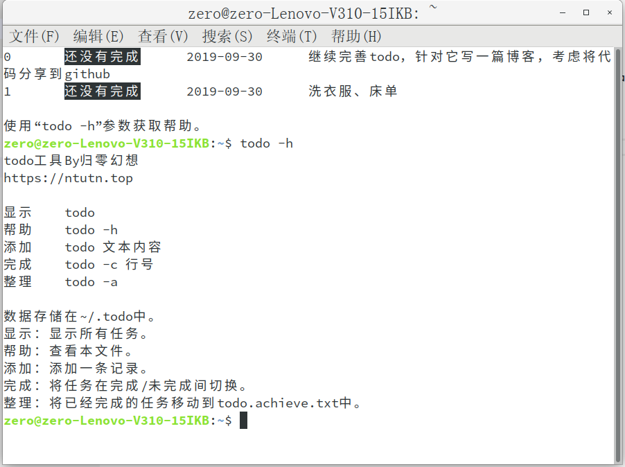

# ctodo
终端todo工具。

也许你需要一个管理日常任务的工具，一个todo list。在其他平台，我们都是用各种便签工具当做备忘录的。虽然在Linux中也能找到这样的工具，但既然都用Linux了，用终端操作岂不是美滋滋？

本工具将会把数据保存在`~/.todo`中。

## 截图


## 安装
```bash
wget https://github.com/zerofancy/ctodo/releases/download/v1.0/ctodo.jar
sudo mkdir /usr/share/ctodo
sudo mv ctodo.jar /usr/share/ctodo/ctodo.jar
echo 'java -jar /usr/share/ctodo/ctodo.jar $*'>todo
sudo chmod +x todo
sudo mv todo /usr/bin/todo
```

然后在终端执行`todo`就可以看到效果了。当然，你也可以使用`nano ~/.bashrc`将其加入`.bashrc`，打开终端就执行。
